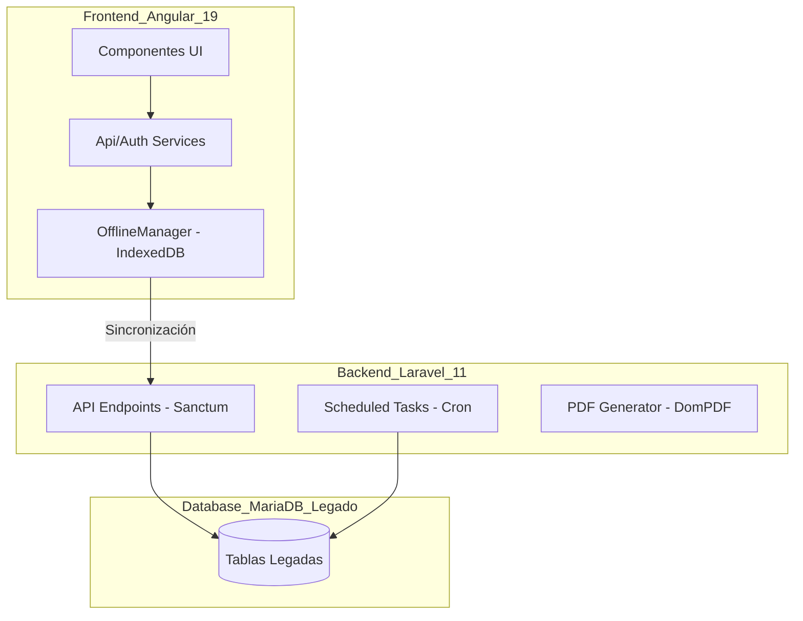

# Arquitectura del Sistema - Fundación Rebuild

## Diagrama de Bloques

## Stack Tecnológico
- **Frontend**: Angular 19, CSS Moderno (Glassmorphism), Reactive Forms, RxJS.
- **Backend**: Laravel 11, Eloquent ORM, Sanctum Auth, Barryvdh/DomPDF.
- **Base de Datos**: MariaDB (Esquema original preservado).
- **Sincronización**: Estrategia Offline-First con reintento secuencial.

## Estrategia de Datos
- Se mantiene el esquema original de MariaDB para asegurar compatibilidad con otros procesos legados si existen.
- Las transacciones de negocio complejas (como el Ingreso) se encapsulan en el Backend para evitar inconsistencias (registros huérfanos).
- Las contraseñas se han migrado de MD5 (legado) a Bcrypt (Laravel) de forma transparente.

## Roles y Permisos
- **SADMIN**: Acceso total (Administración, Finanzas, Reportes, Bitácora).
- **PLANTA**: Personal operativo (Seguimientos, Agenda).
- **PSICO**: Psicólogos (Informes clínicos, Agenda).

## Módulos Críticos Migrados
1. **Ingreso y Biometría**: Captura de firmas (Canvas) y huellas, generación de formularios legales en PDF.
2. **Finanzas (Pagos)**: Gestión de pensiones, abonos y cargos mensuales con trazabilidad.
3. **Tienda e Inventario**: Punto de venta con balance de residentes y códigos de barras (Code128).
4. **Psicología**: Seguimientos clínicos detallados con reportes imprimibles.
5. **Agenda**: Programación de citas y control de asistencia.
6. **Bitácora (Audit Log)**: Registro centralizado de cada acción realizada por los usuarios para auditoría.

## Estrategia de Seguridad
- **Autenticación**: Laravel Sanctum (Tokens).
- **Autorización**: Middleware de roles y permisos.
- **Auditoría**: Tabla `audit_logs` que registra Usuario, Acción, Modelo, Detalles e IP.
- **Documentación**: Swagger/OpenAPI integrado para todos los endpoints.
